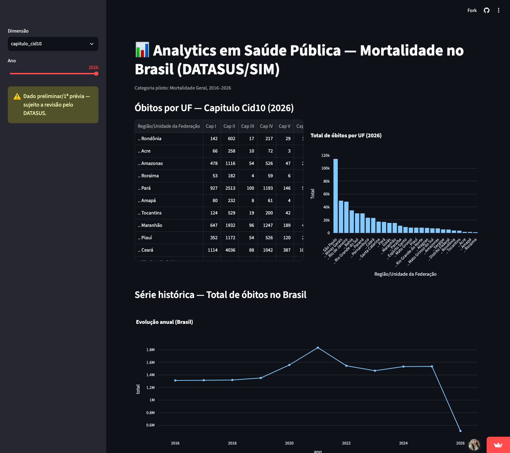

# Analytics em Saúde Pública — Mortalidade no Brasil

Projeto de Analytics sobre mortalidade no Brasil, com base em dados públicos do **DATASUS/SIM (Sistema de Informações sobre Mortalidade)**, cobrindo o período de **2016 a 2026**.

Projeto final da trilha **Analytics** — AI Talent Academy (White Cube), Grupo 6.

🔗 **Demo:** https://analytics-em-saude-publica.streamlit.app/



---

## Stack

Python · Pandas · Streamlit · Plotly · Power BI

---

## Equipe

| Nome | LinkedIn |
|---|---|
| Ariane Moura | [linkedin.com/in/arianemoura](https://www.linkedin.com/in/arianemoura/) |
| Adriana Selestrina Dos Santos | A preencher |
| Abner Ribeiro Lopes | A preencher |
| Alexandre Robalo Da Silva | A preencher |
| Levi Miquéias Lima E Silva | A preencher |

---

## Estrutura do repositório

```
formacao-ai-talent-academy-grupo-06/
├── README.md
├── requirements.txt
├── app.py
│
├── docs/
│   ├── relatorio_tecnico.md
│   ├── alinhamento/
│   ├── proposta/
│   ├── referencia/
│   └── evidencias/
│
├── data/
│   ├── raw/datasus_sim/
│   │   ├── mortalidade_geral/
│   │   ├── obitos_infantis/
│   │   ├── obitos_fetais/
│   │   ├── obitos_causas_externas/
│   │   ├── obitos_mif_maternos/
│   │   ├── causas_evitaveis/
│   │   └── mortalidade_exterior/
│   ├── processed/mortalidade_geral/
│   └── dictionary/
│       └── dicionario_dados.md
│
├── reports/
│   ├── mortalidade_geral/
│   ├── obitos_infantis/
│   ├── obitos_fetais/
│   ├── obitos_causas_externas/
│   ├── obitos_mif_maternos/
│   ├── causas_evitaveis/
│   └── mortalidade_exterior/
│
└── src/
    ├── io/
    │   └── leitura_tabnet.py
    └── cleaning/
        ├── limpeza_mortalidade_geral.py
        ├── padronizacao_categorias.py
        ├── consolidacao_base.py
        └── validacao_final.py
```

---

## Etapas realizadas

- Extração de dados brutos do DATASUS/SIM (TabNet)
- Tratamento de duplicados
- Tratamento de valores nulos e ausentes
- Padronização de categorias (região/UF, capítulos CID-10)
- Consolidação da base em modelo de dados relacional (tabela-fato + dimensões)
- Validação automatizada de qualidade de dados
- Dashboard exploratório publicado (Streamlit)

## Próximas etapas

- Extração e tratamento das demais categorias do SIM
- Análise exploratória de dados (EDA)
- Construção do dashboard final (Power BI)
- Consolidação da documentação técnica

Para o detalhamento completo de cada etapa, decisões técnicas e evidências: ver [`docs/relatorio_tecnico.md`](docs/relatorio_tecnico.md) e [`data/dictionary/dicionario_dados.md`](data/dictionary/dicionario_dados.md).

---

## Como rodar localmente

```bash
# 1. Clonar o repositório
git clone https://github.com/ConectAri/formacao-ai-talent-academy-grupo-06
cd formacao-ai-talent-academy-grupo-06

# 2. Criar e ativar o ambiente virtual
python3 -m venv venv
source venv/bin/activate          # Windows: venv\Scripts\Activate.ps1

# 3. Instalar as dependências
pip install -r requirements.txt

# 4. Testar a leitura dos dados brutos
python src/io/leitura_tabnet.py   # teste de validação (deve dar 45/45 sem erro)

# 5. Rodar o dashboard
streamlit run app.py              # abre em http://localhost:8501
```

---

## Evidências

Prints e screenshots do projeto ficam em [`docs/evidencias/`](docs/evidencias/).

---

> Este README e o [relatório técnico](docs/relatorio_tecnico.md) são documentos vivos, atualizados ao longo do desenvolvimento do projeto.