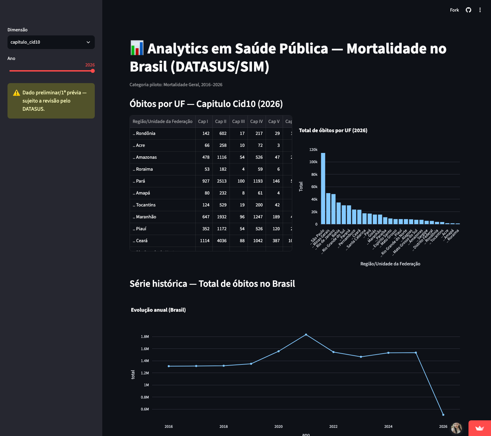
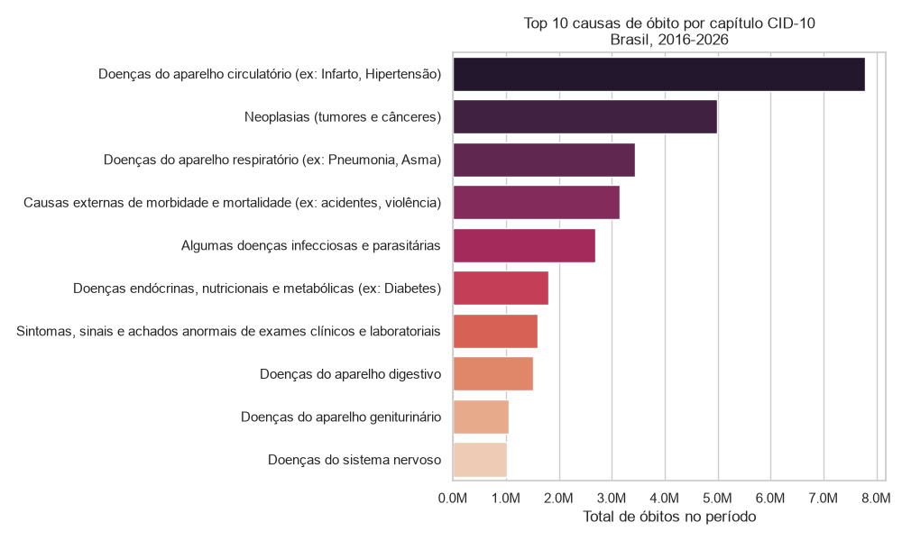
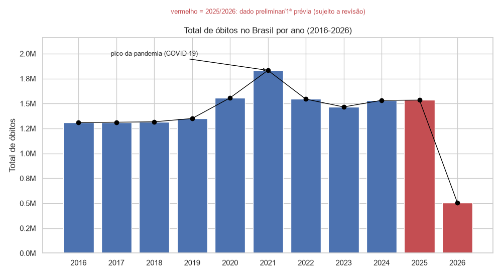

# Analytics em Saúde Pública: Mortalidade no Brasil (DATASUS/SIM)

Projeto final da trilha **Analytics** da AI Talent Academy (White Cube), Grupo 6.

Tratamos os dados públicos de mortalidade do DATASUS (Sistema de Informações sobre Mortalidade, SIM), de 2016 a 2026, e os transformamos em uma base validada, dois painéis publicados e uma análise que responde onde e de que se morre no Brasil. O objetivo é que um gestor de saúde consiga usar esse dado para decidir onde investir em prevenção.

- **Dashboard (Streamlit):** [analytics-em-saude-publica.streamlit.app](https://analytics-em-saude-publica.streamlit.app/)
- **Painel (Looker Studio):** [Painel de Análise de Óbitos - Brasil (CID-10)](https://datastudio.google.com/reporting/0e8a7ab3-6735-4d8b-8f0d-09594e0ef77a)
- **Análise exploratória:** [notebook no nbviewer](https://nbviewer.org/github/ConectAri/formacao-ai-talent-academy-grupo-06/blob/main/notebooks/02_eda_mortalidade_geral.ipynb)



---

## O problema

O SIM registra todos os óbitos do país, e o dado é público. Na prática, ele chega pelo TabNet em dezenas de planilhas, com cabeçalhos de metadados, células preenchidas com traço e região misturada com estado na mesma coluna. Do jeito que sai, serve para consulta pontual, mas não para comparar anos, causas e estados.

A pergunta que guiou o projeto: **quais doenças mais matam, em quem e onde, e o que isso indica para a prevenção?**

## Contexto da apresentação

No Demo Day, apresentamos o projeto como o time de dados de uma empresa farmacêutica fictícia que abre essa base para a gestão pública. A lógica é que diagnóstico precoce e tratamento contínuo na atenção primária custam menos ao SUS do que internação e alta complexidade. O enquadramento é da apresentação; os dados, o código e os resultados deste repositório são os mesmos.

---

## Principais resultados

Números de 2016 a 2024, somando os estados. 2025 e 2026 ficam fora porque ainda são preliminares no DATASUS.

| Achado | Número |
| --- | --- |
| Óbitos registrados no período | 13,2 milhões |
| Participação de doenças circulatórias, câncer e respiratórias | 52,7% |
| Crescimento do total de óbitos (2016 → 2024) | +17% |
| Crescimento de óbitos por câncer e por doenças respiratórias | cerca de +23% cada |
| Óbitos de pessoas com 70 anos ou mais | 51% |
| Pico da série (pandemia de COVID-19) | 1,83 milhão de óbitos em 2021 |

Por capítulo da CID-10, as maiores causas foram: aparelho circulatório (25,5%), neoplasias (16,1%), aparelho respiratório (11,1%), causas externas (10,4%), doenças infecciosas e parasitárias (9,5%) e doenças endócrinas, como diabetes (5,9%).

**Volume não é gravidade.** Em número absoluto, São Paulo lidera os óbitos de 2024 (351.616). Cruzando com a população estimada pelo IBGE para 2024, a taxa por 100 mil habitantes coloca o Rio Grande do Sul em primeiro (903,7), e São Paulo cai para quarto (764,8). A média nacional é 720,7.





---

## O que foi feito

1. **Extração:** exportação das 7 categorias do SIM pelo TabNet, de 2016 a 2026, cada ano cortado por capítulo CID-10, faixa etária, sexo e local de ocorrência.
2. **Limpeza:** o traço do TabNet foi tratado como zero. Conferimos a soma das colunas contra o total em 1.408 linhas, com 100% de correspondência.
3. **Padronização:** região e UF separadas em colunas próprias e capítulos CID-10 mapeados para a descrição oficial da OMS.
4. **Consolidação:** tabela-fato com dimensões, montada depois de confirmar que as 4 dimensões dão o mesmo total nas 352 combinações de ano e UF.
5. **Validação:** um script refaz o pipeline do zero e confere 24 critérios de qualidade. Resultado atual: 24/24.
6. **Análise exploratória:** causas, série histórica, faixa etária, sexo e regiões, a partir da base tratada.
7. **Painéis:** dashboard exploratório em Streamlit e painel complementar em Looker Studio, com filtros por UF, ano, causa e região.

O detalhamento de cada decisão está em [`docs/relatorio_tecnico.md`](docs/relatorio_tecnico.md) e em [`data/dictionary/dicionario_dados.md`](data/dictionary/dicionario_dados.md).

### Escopo

As 7 categorias do SIM foram extraídas e estão em `data/raw/datasus_sim/`. Apenas **Mortalidade Geral** passou pelo pipeline completo de limpeza, validação e análise. As outras 6 ficam no repositório como registro da extração.

---

## Limitações

- 2025 e 2026 são dados preliminares e não entram nas tendências.
- A base é anual, então não permite analisar sazonalidade.
- A taxa por habitante foi calculada só para 2024 e para o total de óbitos, sem recorte por causa ou idade.
- Medimos óbitos, não custo. O projeto não estima gasto em reais.

## Próximos passos

- Cruzar com o SIH/SUS (internações) para estimar o custo por causa de óbito.
- Calcular a taxa por causa e por faixa etária em toda a série de 2016 a 2024.
- Aplicar o pipeline às outras 6 categorias já extraídas.
- Testar um modelo de série temporal para sinalizar estados que fogem do padrão esperado.

---

## Estrutura do repositório

```
formacao-ai-talent-academy-grupo-06/
├── app.py                         dashboard Streamlit
├── requirements.txt
├── data/
│   ├── raw/datasus_sim/           CSVs exportados do TabNet (7 categorias)
│   ├── processed/mortalidade_geral/  base tratada: tabela-fato e dimensões
│   └── dictionary/                dicionário de dados
├── src/
│   ├── io/leitura_tabnet.py       leitura dos CSVs do TabNet
│   └── cleaning/                  limpeza, padronização, consolidação e validação
├── notebooks/                     análise exploratória (EDA)
├── reports/                       gráficos e relatórios por categoria
└── docs/                          relatório técnico, proposta, referências e prints
```

## Como rodar localmente

```bash
git clone https://github.com/ConectAri/formacao-ai-talent-academy-grupo-06
cd formacao-ai-talent-academy-grupo-06

python3 -m venv venv
source venv/bin/activate              # Windows: venv\Scripts\Activate.ps1
pip install -r requirements.txt

python src/io/leitura_tabnet.py       # lê os 45 arquivos brutos, esperado: 45/45
python src/cleaning/validacao_final.py  # refaz o pipeline, esperado: 24/24
streamlit run app.py                  # abre em http://localhost:8501
```

## Stack

Python, Pandas, Matplotlib, Seaborn, Jupyter, Streamlit, Plotly e Google Looker Studio.

## Fontes

- [DATASUS/TabNet, Sistema de Informações sobre Mortalidade (SIM)](https://datasus.saude.gov.br/informacoes-de-saude-tabnet/)
- IBGE, Estimativas da População 2024 (usadas no cálculo da taxa por 100 mil habitantes)
- OMS, Classificação Internacional de Doenças, 10ª revisão (CID-10)

## Equipe

- [Ariane Moura](https://www.linkedin.com/in/arianemoura/)
- [Adriana Selestrina Dos Santos](https://www.linkedin.com/in/adriana-selestrina/)
- [Abner Ribeiro Lopes](https://www.linkedin.com/in/abnerribeiroalves/)
- [Alexandre Robalo Da Silva](https://www.linkedin.com/in/alexandre-robalo)
- [Levi Miquéias Lima E Silva](https://www.linkedin.com/in/levi-limas)
