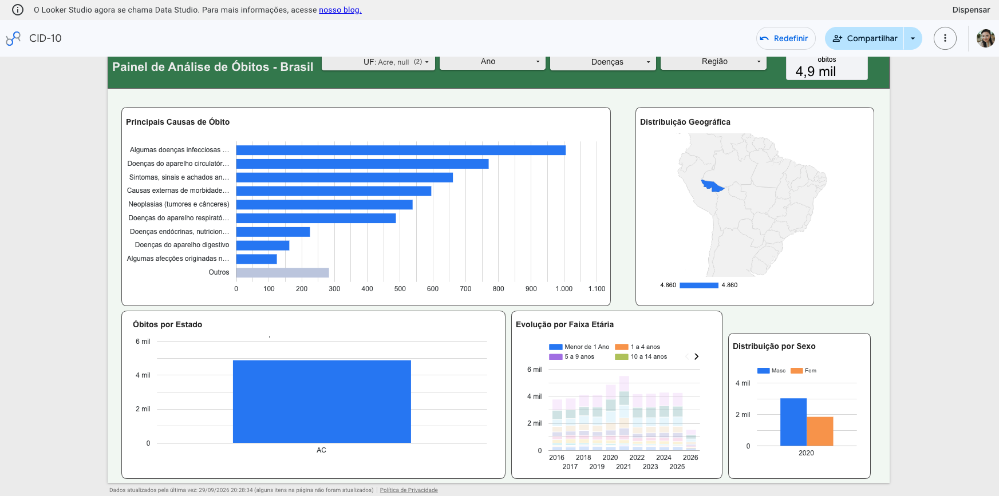

# Mortalidade no Brasil: dados do DATASUS prontos para decidir onde prevenir

Projeto final da trilha Analytics da AI Talent Academy (White Cube), Grupo 6.

Pegamos os dados públicos de óbitos do Sistema de Informações sobre Mortalidade (SIM/DATASUS), de 2016 a 2026, e transformamos dezenas de planilhas do TabNet em uma base validada, dois painéis publicados e uma análise das principais causas de morte no país.

| Entrega | Onde ver |
| --- | --- |
| Dashboard exploratório | [analytics-em-saude-publica.streamlit.app](https://analytics-em-saude-publica.streamlit.app/) |
| Painel analítico | [Looker Studio: Painel de Análise de Óbitos - Brasil (CID-10)](https://datastudio.google.com/reporting/0e8a7ab3-6735-4d8b-8f0d-09594e0ef77a) |
| Análise exploratória | [notebook no nbviewer](https://nbviewer.org/github/ConectAri/formacao-ai-talent-academy-grupo-06/blob/main/notebooks/02_eda_mortalidade_geral.ipynb) |
| Relatório técnico | [`docs/relatorio_tecnico.md`](docs/relatorio_tecnico.md) |
| Dicionário de dados | [`data/dictionary/dicionario_dados.md`](data/dictionary/dicionario_dados.md) |

## Problema

O SIM registra todos os óbitos do país, e o dado é aberto. Só que ele sai do TabNet em planilhas separadas por ano e por recorte, com cabeçalhos de metadados, células com traço no lugar de zero e região misturada com estado na mesma coluna. Do jeito que vem, dá para consultar um número, mas não para comparar anos, causas e estados.

**Pergunta do projeto:** quais doenças mais matam, em quem e onde, e o que isso indica para a prevenção?

No Demo Day, apresentamos o trabalho como o time de dados de uma empresa farmacêutica fictícia que abre essa base para a gestão pública. A premissa é que diagnóstico precoce e tratamento contínuo na atenção primária custam menos ao SUS do que internação e alta complexidade. Os dados e o código são os mesmos; muda só o enquadramento.

## Resultados

Período de 2016 a 2024, somando os estados. 2025 e 2026 ficam de fora porque o DATASUS ainda trata esses anos como preliminares.

| Indicador | Valor |
| --- | --- |
| Óbitos registrados | 13,2 milhões |
| Doenças circulatórias, câncer e respiratórias | 52,7% dos óbitos |
| Crescimento do total de óbitos, 2016 para 2024 | +17% |
| Crescimento de óbitos por câncer e por doenças respiratórias | cerca de +23% cada |
| Óbitos de pessoas com 70 anos ou mais | 51% |
| Ano de pico (pandemia de COVID-19) | 2021, com 1,83 milhão de óbitos |

**Causas.** Por capítulo da CID-10: aparelho circulatório (25,5%), neoplasias (16,1%), aparelho respiratório (11,1%), causas externas (10,4%), doenças infecciosas e parasitárias (9,5%) e doenças endócrinas, como diabetes (5,9%).

**Volume não é gravidade.** São Paulo tem o maior número de óbitos em 2024 (351.616). Dividindo pela população estimada pelo IBGE para 2024, o Rio Grande do Sul passa a ter a maior taxa, com 903,7 óbitos por 100 mil habitantes, e São Paulo cai para quarto (764,8). A média nacional é 720,7.


## Método

| Etapa | O que fizemos | Como conferimos |
| --- | --- | --- |
| Extração | Exportamos as 7 categorias do SIM pelo TabNet, de 2016 a 2026, com quatro recortes por ano: capítulo CID-10, faixa etária, sexo e local de ocorrência | 45 arquivos de Mortalidade Geral lidos sem erro |
| Limpeza | Tratamos o traço do TabNet como zero | A soma das colunas bateu com o total em 1.408 linhas (100%) |
| Padronização | Separamos região e UF em colunas próprias e mapeamos os capítulos CID-10 para a descrição oficial da OMS | Tabela de referência reutilizável em `referencia_cid10.csv` |
| Consolidação | Montamos uma tabela-fato com dimensões | Os 4 recortes dão o mesmo total nas 352 combinações de ano e UF |
| Validação | Um script refaz o pipeline do zero | 24 de 24 critérios de qualidade aprovados |

**Escopo.** As 7 categorias do SIM foram extraídas e estão em `data/raw/datasus_sim/`. Só Mortalidade Geral passou pelo pipeline completo e pela análise. As outras 6 ficam no repositório como registro da extração.

## Painéis

**Streamlit.** Filtros por dimensão (causa, faixa etária, sexo ou local de ocorrência) e por ano, com aviso quando o ano escolhido é preliminar. Mostra o ranking de óbitos por UF e a série histórica nacional.

[Abrir o dashboard no Streamlit](https://analytics-em-saude-publica.streamlit.app/)


**Looker Studio.** Filtros por UF, ano, doença e região. Mostra as principais causas, o mapa de óbitos por estado, a evolução por faixa etária e a distribuição por sexo.

[Abrir o painel no Looker Studio](https://datastudio.google.com/reporting/0e8a7ab3-6735-4d8b-8f0d-09594e0ef77a)



## Como reproduzir

```bash
git clone https://github.com/ConectAri/formacao-ai-talent-academy-grupo-06
cd formacao-ai-talent-academy-grupo-06

python3 -m venv venv
source venv/bin/activate                 # Windows: venv\Scripts\Activate.ps1
pip install -r requirements.txt

python src/io/leitura_tabnet.py          # esperado: 45/45 arquivos lidos
python src/cleaning/validacao_final.py   # esperado: 24/24 checagens OK
streamlit run app.py                     # abre em http://localhost:8501
```

## Limitações e próximos passos

| Limitação | Próximo passo |
| --- | --- |
| O projeto mede óbitos, não custo | Cruzar com o SIH/SUS (internações) para estimar o gasto por causa |
| A taxa por habitante foi calculada só para 2024 e para o total de óbitos | Calcular a taxa por causa e faixa etária em toda a série |
| A base é anual e não mostra sazonalidade | Testar um modelo de série temporal para sinalizar estados fora do padrão |
| Só Mortalidade Geral foi processada | Aplicar o pipeline às outras 6 categorias já extraídas |

## Estrutura do repositório

```
formacao-ai-talent-academy-grupo-06/
├── app.py                            dashboard Streamlit
├── requirements.txt
├── data/
│   ├── raw/datasus_sim/              CSVs exportados do TabNet (7 categorias)
│   ├── processed/mortalidade_geral/  base tratada: tabela-fato e dimensões
│   └── dictionary/                   dicionário de dados
├── src/
│   ├── io/leitura_tabnet.py          leitura dos CSVs do TabNet
│   └── cleaning/                     limpeza, padronização, consolidação e validação
├── notebooks/                        análise exploratória (EDA)
├── reports/                          gráficos e relatórios por categoria
└── docs/                             relatório técnico, proposta, referências e prints
```

## Fontes e ferramentas

**Dados:** [DATASUS/TabNet, SIM](https://datasus.saude.gov.br/informacoes-de-saude-tabnet/); IBGE, Estimativas da População 2024; OMS, CID-10.

**Ferramentas:** Python, Pandas, Matplotlib, Seaborn, Jupyter, Streamlit, Plotly e Google Looker Studio.

## Equipe

- [Ariane Moura](https://www.linkedin.com/in/arianemoura/)
- [Adriana Selestrina Dos Santos](https://www.linkedin.com/in/adriana-selestrina/)
- [Abner Ribeiro Lopes](https://www.linkedin.com/in/abnerribeiroalves/)
- [Alexandre Robalo Da Silva](https://www.linkedin.com/in/alexandre-robalo)
- [Levi Miquéias Lima E Silva](https://www.linkedin.com/in/levi-limas)
